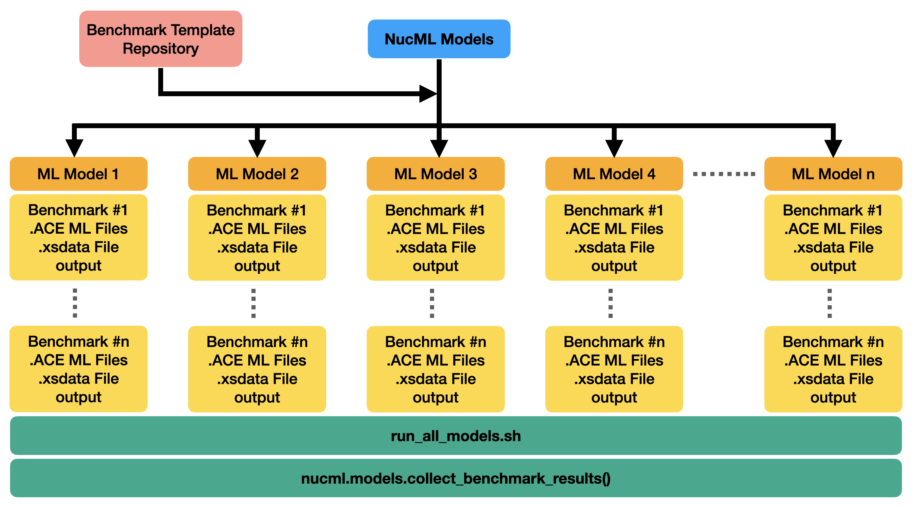

.. _validating-datasets-label:

Validating ML Models
====================

.. Note::

    Documentation in progress. Please look at the ML_Nuclear_Data repository for hands-on tutorials on validating ML-models using
    criticality benchmarks with SERPENT2 using NucML.

Validation is perhaps the most important step in the entire pipeline. The evaluated data must perform at least better in applicable benchmarks than the previously 
released version of the library. In ML solutions, generalization is the end-goal. Algorithms usually optimize and try to minimize a loss function but EXFOR is far 
from perfect. A model that generalizes well to other EXFOR datapoints is not necessarily the best model. Therefore, we cannot rely on performance metrics derived 
from EXFOR data (even if splitted or cross-validated) to select the best performing model. Instead, a series of trained models need to be tested and validated 
using all available benchmarks. The model with the best average performance can be regarded as the best model. This is quite different from both established NDE 
and traditional ML but so is the nature of the challenge. 

The benchmarking utilities provided are built on top of this methodology. Once a series of models are trained there are various steps needed to set up the validation 
phase. These include (1) querying the model for relevant cross-section data for a given benchmark, (2) processing the results and converting them into appropriate 
user-code formats, (3) building metadata files used by the same codes, (4) modify the benchmark inputs accordingly, (5) run the calculation, and (6) analyze the output.
This process has to be performed for each trained model and for each benchmark. By making use of a benchmark template repository, NucML can seamlessly run all steps 
of the validation phase for all trained models and all available benchmarks. Once all necessary files are created, a single 
bash script is provided containing all necessary instructions to run all benchmark cases for all models. The results can be collected quickly from the output of all 
calculations using built-in functionalities. Currently, only SERPENT2 is supported. Additional capabilities include a fast and easy comparison between ML- and 
ENDF-based benchmark calculations for fast reporting.