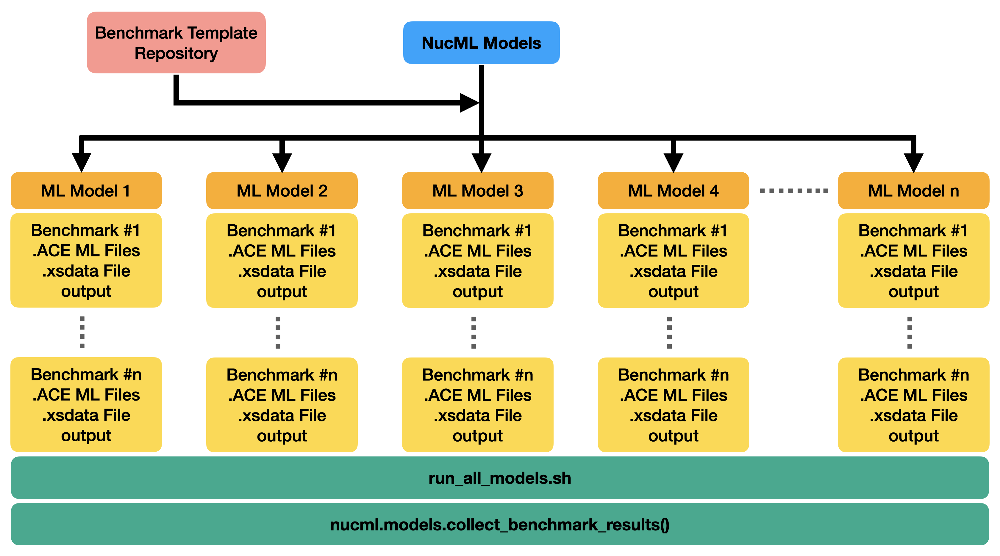

.. _navigating-the-nde-label:

.. note::

    All tutorials showed here (and more) can be downloaded from the :code:`ML_Nuclear_Data` repository `here <https://github.com/pedrojrv/ML_Nuclear_Data>`_.

Loading Data
============

Identifying, parsing, and formatting all nuclear data sources can be a tedious time-consuming job. NucML contains a variety of utilities 
that make it easy to download and load the latest versions of the EXFOR, RIPL, ENDF, and AME libraries easily. To convert these into ML-friendly datasets, 
parsing utilities are available to read library-native formats, restructure the information, and store the resulting data structure into single 
easy-to-use files.

.. toctree::
    :maxdepth: 2

    notebooks/1_Loading_AME_Datasets
    notebooks/2_Loading_EXFOR_Datasets
    notebooks/1_Loading_ENSDF_RIPL_Datasets
    notebooks/0_Loading_and_Plotting_Evaluations

Exploratory Data Analysis
=========================

Thoroughly exploring and analyzing your data before modeling is very important. Both EXFOR and XUNDL/RIPL are very unconventional datasets compared 
to traditional structured data. Care must be taken to understand the strengths but also limitations.

.. toctree::
    :maxdepth: 1

    notebooks/2_EDA_AME
    notebooks/3_EDA_EXFOR
    notebooks/3_EDA_Cross_Sections
    notebooks/2_EDA_RIPL

Modeling Data
=============

In the evaluation phase of the traditional NDE pipeline, relevant data is used to guide physics-based model calculations which result in best estimates, 
dependent on data availability, of mean values including uncertainties and covariances. These values can then form part of one or more regional libraries (i.e., ENDF). 
As previously mentioned, the ML-NDE pipeline instead makes use of trained ML models to create reaction cross-section data and therefore to generate ML-based libraries. 

The NucML Model utilities provide various python script examples to train various ML algorithms including scikit-learn models (i.e. K-nearest-neighbors, 
Decision Trees), Gradient Boosting Machines, and Neural Networks. It is built around a strict ML management philosophy by keeping track of model 
hyperparameters and resulting performance metrics for the supported models. Other ML management tools like Comet ML and Weights and Biases can be 
configured and used using user-provided credentials. It is the goal of NucML to first and foremost provide researchers the framework and tools to create, 
train, and analyze their models rather than providing a set of optimized algorithms. 

Please refer to the following links for example python scripts for different models.

.. note::

    Links will not work as scripts are not yet public.

* `Decision-Trees (DT) <https://github.com/pedrojrv/ML_Nuclear_Data/blob/master/ML_EXFOR_neutrons/2_DT/dt.py>`_
* `K-Nearest-Neighbor (KNN) <https://github.com/pedrojrv/ML_Nuclear_Data/blob/master/ML_EXFOR_neutrons/1_KNN/knn.py>`_
* `XGBoost (Gradient Boosting Machines) <https://github.com/pedrojrv/ML_Nuclear_Data/blob/master/ML_EXFOR_neutrons/3_XGB/xgb.py>`_
* `Neural Networks <https://github.com/pedrojrv/ML_Nuclear_Data/tree/master/ML_EXFOR_neutrons/4_NN>`_ 

Processing Data for Monte Carlo
===============================

.. warning::

    Documentation section in progress.

In the processing stage, evaluated data is transformed into formats (i.e. ACE files) readable by user codes like SERPENT and MCNP. Having a great model 
is only half the process. Tools are needed to efficiently create entire evaluated libraries consisting of cross-sections for all needed isotopes and 
reaction channels. Currently, NucML offers the capabilities to create isotopic .ace files by simply supplying a user-trained model. The python package 
will take care of querying the model for predictions using the same energy grid as the original .ACE files for compatibility. Additionally, some stability 
options are included. Since these algorithms are not expected to be perfect, NucML Ace is built under the assumption that the best solution is a 
hybrid solution. In other words, traditional tools must work together with ML models to create a good evaluation. By default, NucML Ace will 
stabilize the 1/v region using evaluated library values. 

The benchmarking utilities provided are built on top of this methodology. Once a series of models are trained there are various steps needed to set up the validation 
phase. These include (1) querying the model for relevant cross-section data for a given benchmark, (2) processing the results and converting them into appropriate 
user-code formats, (3) building metadata files used by the same codes, (4) modify the benchmark inputs accordingly, (5) run the calculation, and (6) analyze the output.
This process has to be performed for each trained model and for each benchmark. By making use of a benchmark template repository, NucML can seamlessly run all steps 
of the validation phase for all trained models and all available benchmarks. Once all necessary files are created, a single 
bash script is provided containing all necessary instructions to run all benchmark cases for all models. The results can be collected quickly from the output of all 
calculations using built-in functionalities. Currently, only SERPENT2 is supported. Additional capabilities include a fast and easy comparison between ML- and 
ENDF-based benchmark calculations for fast reporting. Check the following example on how to generate ML cross sections, benchmark inputs, and 
bash shell scripts to aumate your model evaluations. 

.. toctree::
    :maxdepth: 1

    notebooks/0_Generating_MLXS_Benchmark

Validating using Benchmarks
===========================

.. warning::

    Documentation section in progress.

Validation is perhaps the most important step in the entire pipeline. The evaluated data must perform at least better in applicable benchmarks than the previously 
released version of the library. In ML solutions, generalization is the end-goal. Algorithms usually optimize and try to minimize a loss function but EXFOR is far 
from perfect. A model that generalizes well to other EXFOR datapoints is not necessarily the best model. Therefore, we cannot rely on performance metrics derived 
from EXFOR data (even if splitted or cross-validated) to select the best performing model. Instead, a series of trained models need to be tested and validated 
using all available benchmarks. The model with the best average performance can be regarded as the best model. This is quite different from both established NDE 
and traditional ML but so is the nature of the challenge. Check the following example on how to collect the data generated by the benchmark calculations.

.. toctree::
    :maxdepth: 1

    notebooks/1_Gathering_Benchmark_Results_DT

