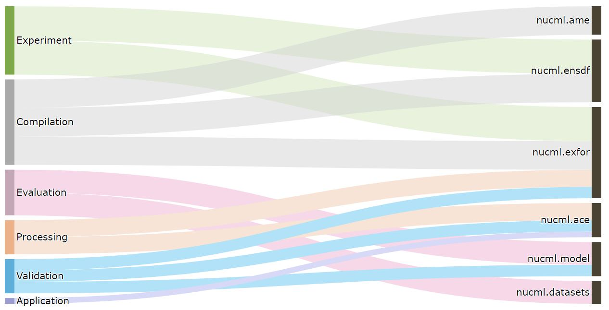

.. _what-is-nucml-label:

What is NucML?
==============

NucML is the first and only end-to-end python-based supervised machine learning pipeline for enhanced bias-free nuclear data generation 
and evaluation to support the advancement of next-generation nuclear systems. It offers capabilities that allow researchers to navigate 
through each step of the ML-based nuclear data cross section evaluation pipeline. Some of the supported activities include dataset 
parsing and compilation of reaction data, exploratory data analysis, data manipulation and feature engineering, model training and evaluation, 
and validation via criticality benchmarks. All these activities are supported by the various modules and submodules offered through the 
NucML package.

A more detailed description of the philosophy behind the code can be found here.